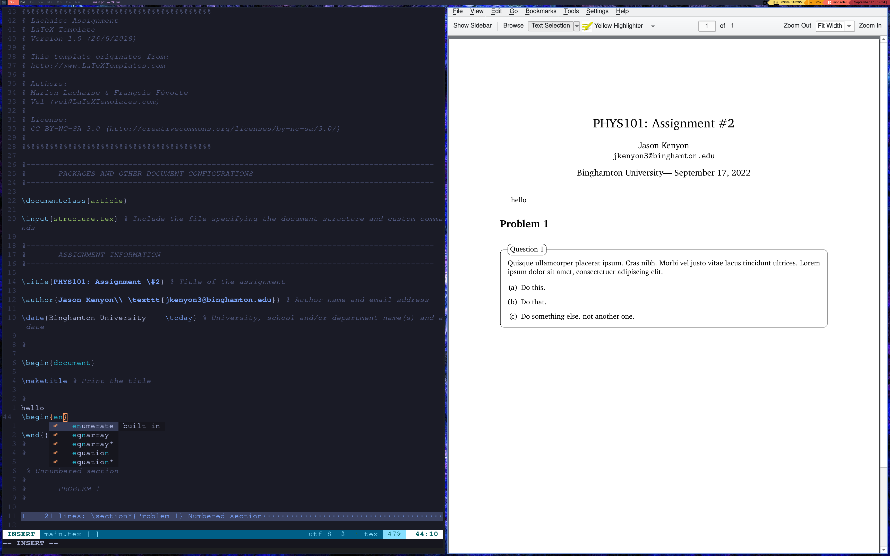

# Neovim Config
## `~/.config/nvim/init.lua`


[](https://img.shields.io/github/followers/jason0kenyon?style=for-the-badge)

This is my config for neovim. I often write LaTeX documents and code in Python, C/C++, and Bash. I hope you like it :)
Feel free to contact me with any questions, issues, or other via email: jason0kenyon@gmail.com.

## Requirements
- [Neovim](https://github.com/neovim/neovim)
- [Packer](https://github.com/wbthomason/packer.nvim) plugin manager for neovim
- Nodejs and npm must be in your PATH
- [ghcup](https://gitlab.haskell.org/haskell/ghcup-hs) must be in your PATH
- [unzip](https://github.com/LuaDist/unzip) must be in your PATH
- [Fonts](https://github.com/ryanoasis/nerd-fonts) for status bar
- [VS Code icon font](https://github.com/microsoft/vscode-codicons/blob/main/dist/codicon.ttf) for autocomplete menu

## Features

- Native syntax highlighting and indentation, provided by the neovim team.
- Native language servers and simple front-end installer
- Easy-to-use plugin manager
- Quick TeX document compilation (open up your pdf document on the side in a pdf viewer such as okular and press C-p in normal mode to write and compile)
- Git-integrated [file tree](https://github.com/kyazdani42/nvim-tree.lua) (in normal mode, press C-o to toggle)
- Pretty [colorscheme](https://github.com/folke/tokyonight.nvim) and [status bar](https://github.com/nvim-lualine/lualine.nvim)
## Installation
Install Packer 
Clone this repository into your .config directory. Ensure that your nvim folder is removed first.
```bash
git clone https://github.com/jason0kenyon/neovim-config.git ~/.config/nvim
```
Download the VS Code icon ttf file and copy it to `~/.local/share/fonts/` and install the aformentioned package of fonts. You may do so manually, or perhaps your package manager offers a package for it. In fact, this package may be excessive, as any single patched font would suffice. If possible, use your package manager; it knows best.

Start nvim and run the following commands to install plugins, language servers, and language parsers (required for syntax highlighting, indentation, and snippets):
```vim
:PackerSync
:LspInstall <desired languages>
:TSInstall <desired languages>
```

See [LSP's repository](https://github.com/neovim/nvim-lspconfig/blob/master/doc/server_configurations.md) and [Tree Sitter's repository](https://github.com/nvim-treesitter/nvim-treesitter#available-modules) for supported languges.

If you want to use a another language, then you not only have to install but you must also configure it in `~/.config/nvim/lua/cmp_cfg.lua`
Add the following to the end of the file, replacing "your language" with the language server of your choice:
```lua   
  require('lspconfig')['<your language>'].setup {
    capabilities = capabilities
  }
```
Now ensure that you have installed everything correctly:
```vim
:PackerStatus
:LspInstallInfo
:TSInstallInfo
```
You should now have a beautiful, working neovim config. Enjoy :)
## Keybindings
### Neovim
- jk: enter normal mode from insert mode
- C-k: write file in normal mode
- C-p: write file and compile to pdf using pdflatex in normal mode 
- C-o: toggle file browser
### Autocomplete menu 
- Return: accept completion
- Up: browse up 
- Down: browse down
- C-Right: exit autocomplete menu 
  
